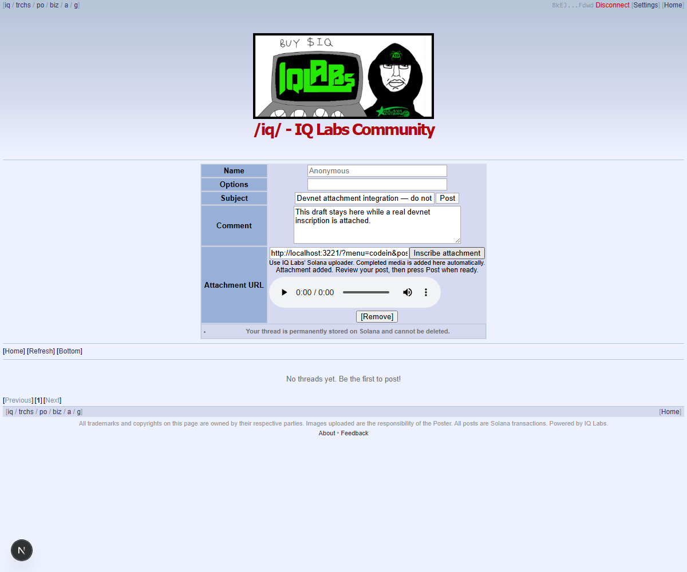
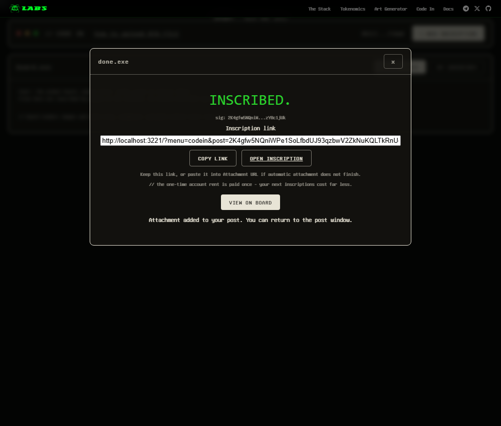

# Attachment integration handoff — NOT READY

This is a fork-only integration snapshot. It does not approve a PR, merge or deployment. Continue locally, on devnet or Surfpool; do not spend mainnet funds. Book work remains deferred.

## Check out these branches together

| Component | Fork branch | Tested source commit |
| --- | --- | --- |
| Uploader | [NubsCarson/iq6900 — handoff/attachments-sep23](https://github.com/NubsCarson/iq6900/tree/handoff/attachments-sep23) | `8e6e77a` before handoff documentation |
| Gateway | [NubsCarson/iq-gateway — handoff/attachments-sep23](https://github.com/NubsCarson/iq-gateway/tree/handoff/attachments-sep23) | `8d4e20f` before handoff documentation |
| Frontend | [NubsCarson/iq-chan — handoff/attachments-sep23](https://github.com/NubsCarson/iq-chan/tree/handoff/attachments-sep23) | `4f1105e` before handoff documentation |
| SDK | [NubsCarson/iqlabs-solana-sdk — review/iq-sdk-confirmation-resume](https://github.com/NubsCarson/iqlabs-solana-sdk/tree/review/iq-sdk-confirmation-resume) | `037e2e344b288723554a7ab50f286631ec39c512` |

The local SDK source used for the signed run matched that SDK commit, including staged changes in its original working directory. Build and use that SDK checkout; do not silently substitute the unpatched published 0.3.6 package and claim the same result. SDK PR #25 remains open.

The uploader was integrated onto Zo's `1e3c78c` master (HOOD IN). Frontend main was `592527b`; gateway main was `d6fa6a4`. Recheck upstream before further integration.

Existing PR branches were not rewritten: uploader #5 and frontend #31 remain drafts; gateway #32 has not automatically received this follow-up. Uploader #5's old branch still conflicts until deliberately updated or superseded. Its prerequisite viewer/funding fixes from uploader #4 are included here.

## Changes

- Preserves Zo's HOOD IN adapter, ID3 metadata, filenames, ASCII controls, inventory source and tab-loading fixes while retaining automatic attachment return.
- Accepts Code In's encoded `;name=...;base64,` parameter in the uploader and gateway. HTML/SVG and malformed media stay rejected; filenames are not used as paths or response headers.
- Preserves the original Attachment URL field, automatic return, copyable share link, closed-parent recovery and separate Post action. Uploading never posts a thread by itself.
- Automatic return carries Solana signatures only. HOOD IN remains a standalone EVM upload flow. Native EVM automatic attachment is not implemented; an EVM hash must never be reported as a Solana signature.

## Evidence and limits

- 26 uploader tests, 149 gateway tests and 75 frontend tests passed.
- Frontend TypeScript and production build passed. Installed dependencies were reused; clean-install reproduction is still needed on the receiving machine.
- Full real BlockChan + IQ6900 browser flow uploaded a 4,044-byte WAV named `my track; #1 (live).wav`, returned it automatically and preserved the draft.
- Manual paste worked, gateway bytes matched exactly, and audio played to completion in the production frontend build (0.25 seconds, no media error).
- Five real public-devnet transactions finalized without errors. Spend: 0.003025 devnet SOL. Burner refunded to zero. No mainnet writes.
- The uploader used a generated devnet signer; the posting form used a connection-only Wallet Standard test adapter. This was not a Phantom extension test, and no thread/reply was posted. HOOD IN coverage is an isolated UI regression, not a signed EVM upload.

[Browser result](../tests/evidence/sep23/browser-result.json) · [Finalized receipts](../tests/evidence/sep23/verified-receipts.json) · [Playback result](../tests/evidence/sep23/production-smoke.json) · [Build log](../tests/evidence/sep23/frontend-build.log) · [Reference runners](../tests/evidence/sep23/windows-reference/README.md)

## Next agent: ordered work

1. Clone the four branches, verify their heads and install from each lockfile. Build the SDK and record source/dependency versions. Run uploader `cd tests && npm ci && npm test`; gateway `bun test`; frontend `npm ci && npm test && npx tsc --noEmit && npm run build` (Bun required).
2. Adapt the reference runners to the receiving machine. Start the actual apps with explicit devnet endpoints and a dedicated test wallet; preserve the genesis check. Recorded frontend settings: `NEXT_PUBLIC_INSCRIPTION_URL=http://localhost:3221/`, `NEXT_PUBLIC_RPC_ENDPOINT=http://localhost:3221/rpc`, `NEXT_PUBLIC_GATEWAY_URL=http://localhost:3221`, `NEXT_PUBLIC_NETWORK=solana`. The uploader build also replaces its compiled mainnet RPC/gateway/cluster; frontend settings alone do not switch the uploader.
3. Test actual Phantom connection, funding signature, upload and returned media. On devnet, exercise a thread and reply if test-board permissions allow. Verify cancellation, rejected signatures, closed/reloaded popup, delayed return and manual recovery. Review Post-while-uploading: the current listener stops when the form becomes disabled, leaving the saved link as recovery. Decide whether posting should wait or explicitly proceed without the pending attachment; do not claim that race is resolved.
4. Check mobile behavior and intended hosting headers, especially opener isolation/COOP. Loopback success does not prove production cross-origin behavior. Add a signed EVM testnet/local-chain test if expanding HOOD IN integration; do not spend Robinhood mainnet funds.
5. Review PR overlap and coordinate the SDK/uploader/gateway/frontend rollout. Obtain Nubs/Zo review before marking drafts ready or deploying. Update old PR branches deliberately; do not blindly force-push rewritten uploader history over concurrent work.

These notes record work and remaining checks. They do not independently authorize messages to Zo, new issue comments, further pushes or deployment; follow the receiving task's user instructions.

## All currently open Nubs PRs in IQCoreTeam

Verified September 23, 2026: each branch below exists on the named fork and its
head matches the PR. The PR discussion/reviews live in the IQCoreTeam repository;
the proposed code lives on the NubsCarson fork branch. Non-draft means open for
review, not necessarily approved, tested on this machine or ready to deploy.

The new `handoff/attachments-sep23` branches are separate integration snapshots.
They do not replace these PR heads. Check both the PR comments and the integration
handoff before continuing. PRs outside the attachment work are listed for discovery,
not an instruction to broaden the task or resume deferred book work.

Gateway detail: the existing gateway PRs originate from
`NubsCarson/iq-gateway-contributions`; the new integration handoff is on
`NubsCarson/iq-gateway`. Both repositories belong to Nubs. Use the exact links below.

| PR | Status | Fork branch | Verified head |
| --- | --- | --- | --- |
| [iq6900#5: NOT READY: Return inscriptions to posting apps with a copyable link](https://github.com/IQCoreTeam/iq6900/pull/5) | Draft | [NubsCarson/iq6900:review/inscription-return-to-post](https://github.com/NubsCarson/iq6900/tree/review/inscription-return-to-post) | `2754ca5d88e0` |
| [iq-gateway#33: Update compatible gateway RPC and YAML dependencies](https://github.com/IQCoreTeam/iq-gateway/pull/33) | Draft | [NubsCarson/iq-gateway-contributions:review/iq-gateway-dependencies](https://github.com/NubsCarson/iq-gateway-contributions/tree/review/iq-gateway-dependencies) | `4a309fb574f5` |
| [iq-chan#32: Update WalletConnect and Next PostCSS dependencies](https://github.com/IQCoreTeam/iq-chan/pull/32) | Draft | [NubsCarson/iq-chan:review/iq-chan-dependencies](https://github.com/NubsCarson/iq-chan/tree/review/iq-chan-dependencies) | `2ba007cf20d2` |
| [iq-chan#31: NOT READY: Add inscription attachments with automatic return and URL fallback](https://github.com/IQCoreTeam/iq-chan/pull/31) | Draft | [NubsCarson/iq-chan:review/iq-chan-inscription-media](https://github.com/NubsCarson/iq-chan/tree/review/iq-chan-inscription-media) | `4f1105ebed7d` |
| [iq6900#4: Fix inscription metadata rendering and fresh-wallet funding](https://github.com/IQCoreTeam/iq6900/pull/4) | Open, non-draft | [NubsCarson/iq6900:review/iq6900-viewer-funding](https://github.com/NubsCarson/iq6900/tree/review/iq6900-viewer-funding) | `c68c95303d1e` |
| [iq-gateway#32: Serve inscribed media for BlockChan and HoodChan previews](https://github.com/IQCoreTeam/iq-gateway/pull/32) | Open, non-draft | [NubsCarson/iq-gateway-contributions:review/iq-gateway-inscription-media](https://github.com/NubsCarson/iq-gateway-contributions/tree/review/iq-gateway-inscription-media) | `6d589b86756a` |
| [iq-chan#30: Show homepage threads without waiting for slow boards or images](https://github.com/IQCoreTeam/iq-chan/pull/30) | Open, non-draft | [NubsCarson/iq-chan:review/iq-chan-home-progress](https://github.com/NubsCarson/iq-chan/tree/review/iq-chan-home-progress) | `0f0a42e82174` |
| [iqlabs-solana-sdk#25: Fix failed confirmations and interrupted upload retries](https://github.com/IQCoreTeam/iqlabs-solana-sdk/pull/25) | Open, non-draft | [NubsCarson/iqlabs-solana-sdk:review/iq-sdk-confirmation-resume](https://github.com/NubsCarson/iqlabs-solana-sdk/tree/review/iq-sdk-confirmation-resume) | `037e2e344b28` |
| [iq-gateway#31: Avoid immediate duplicate RPC scans after filling table caches](https://github.com/IQCoreTeam/iq-gateway/pull/31) | Open, non-draft | [NubsCarson/iq-gateway-contributions:codex/cache-local-audit-20260922](https://github.com/NubsCarson/iq-gateway-contributions/tree/codex/cache-local-audit-20260922) | `e62ae13db2dd` |
| [iq-git-cli#4: Upgrade IQ SDKs for v1 uploads and preserve offline commits](https://github.com/IQCoreTeam/iq-git-cli/pull/4) | Open, non-draft | [NubsCarson/iq-git-cli:chore/sdk-v1](https://github.com/NubsCarson/iq-git-cli/tree/chore/sdk-v1) | `1bab5cfe09b9` |
| [on-chaingit-frontend#9: Keep Pages settings synchronized after reads and commits](https://github.com/IQCoreTeam/on-chaingit-frontend/pull/9) | Open, non-draft | [NubsCarson/on-chaingit-frontend:codex/iqgit-pages-state-20260916](https://github.com/NubsCarson/on-chaingit-frontend/tree/codex/iqgit-pages-state-20260916) | `114e37251d37` |
| [iqlabs-solana-sdk-python#1: Install AnchorPy test dependencies with the dev extra](https://github.com/IQCoreTeam/iqlabs-solana-sdk-python/pull/1) | Open, non-draft | [NubsCarson/iqlabs-solana-sdk-python:codex/python-test-dependencies-20260916](https://github.com/NubsCarson/iqlabs-solana-sdk-python/tree/codex/python-test-dependencies-20260916) | `636337bbce5e` |
| [on-chaingit-frontend#8: Allow deployment-specific Solana RPC endpoints](https://github.com/IQCoreTeam/on-chaingit-frontend/pull/8) | Open, non-draft | [NubsCarson/on-chaingit-frontend:codex/configurable-solana-rpc-20260916](https://github.com/NubsCarson/on-chaingit-frontend/tree/codex/configurable-solana-rpc-20260916) | `a0627a8026fc` |
| [on-chaingit-frontend#7: Fix provider nesting and duplicate repository cards](https://github.com/IQCoreTeam/on-chaingit-frontend/pull/7) | Open, non-draft | [NubsCarson/on-chaingit-frontend:codex/repository-gallery-rendering-20260916](https://github.com/NubsCarson/on-chaingit-frontend/tree/codex/repository-gallery-rendering-20260916) | `f5f20290524c` |
| [iq-wide-web#3: Render inscribed files at transaction URLs](https://github.com/IQCoreTeam/iq-wide-web/pull/3) | Open, non-draft | [NubsCarson/iq-wide-web:codex/transaction-viewer-20260916](https://github.com/NubsCarson/iq-wide-web/tree/codex/transaction-viewer-20260916) | `523be92349c2` |
