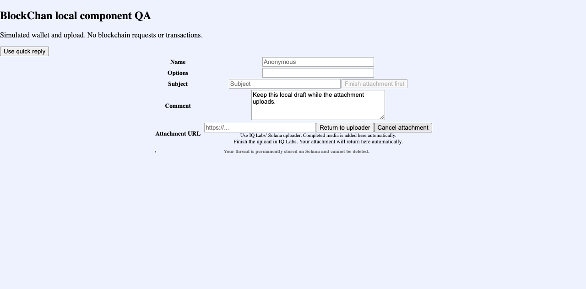
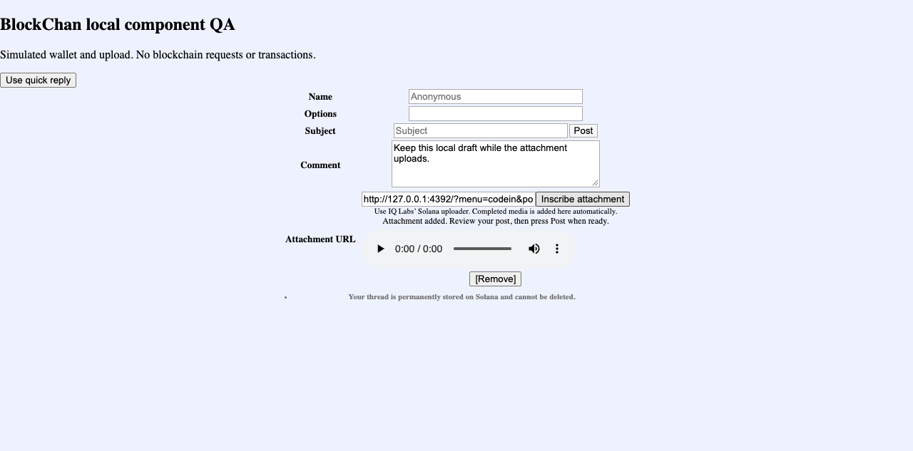
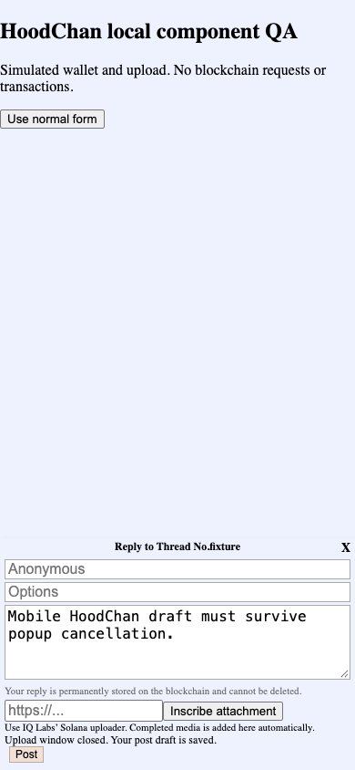
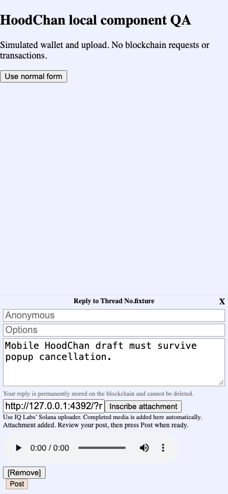

# Coordinated Mac preparation — no PR or deployment approval

**Latest checkpoint:** [real Phantom devnet run and inscription-only composer](phantom-devnet-20260923.md). That run supersedes the real-Phantom gap below. The original simulation evidence remains separate historical evidence. Manual URL entry has since been removed at Nubs' request. Production and physical mobile-wallet checks remain open.

This supplements the [other PC's handoff](https://github.com/NubsCarson/iq6900/blob/handoff/attachments-sep23/docs/attachment-handoff-sep23.md). Its changes and history are incorporated, not overwritten. These are new preparation branches; existing PR branches and readiness were left alone.

## Tested sources

| Component | Fork branch | Source commit before this documentation |
|---|---|---|
| iq-gateway | [codex/iq-gateway-ready-20260923](https://github.com/NubsCarson/iq-gateway/tree/codex/iq-gateway-ready-20260923) | `7fcf0e322c98ae84312442c7bba279a9be67e527` |
| iq-chan | [codex/iq-chan-ready-20260923](https://github.com/NubsCarson/iq-chan/tree/codex/iq-chan-ready-20260923) | `6aa135c50c9e19ddae11c736bb9a2bfdf7a2c7d1` |
| iq6900 | [codex/iq6900-ready-20260923](https://github.com/NubsCarson/iq6900/tree/codex/iq6900-ready-20260923) | `b54031cf09c27940dd9880a7eafafd86af832e77` |

SDK source remains [`037e2e344b288723554a7ab50f286631ec39c512`](https://github.com/NubsCarson/iqlabs-solana-sdk/commit/037e2e344b288723554a7ab50f286631ec39c512), from `review/iq-sdk-confirmation-resume`. This is not the unpatched published SDK.

Peer handoffs incorporated: uploader `0fe014347d8d40182affbc1d11b52d7d46a43578`, gateway `452228211ad1642e95da9433251d326b53078a39`, frontend `a0a77670fac2682ff6ea3e96b64c62d8c5b30948`. Upstream bases: uploader `1e3c78c`, gateway `d6fa6a4`, frontend `592527b`. Recheck these before further changes.

## What changed here

- Gateway combines cache PR #31, media support, the dependency update and the peer's strict filename parser. It accepts encoded `;name=...` media without putting filenames in headers; SVG/HTML and malformed parameters remain rejected.
- Both dependency locks were repaired from a clean tree. All previously locked package versions were preserved. Native renderer packages for Mac, Linux ARM and other supported platforms are present again; npm and frozen Bun clean installs render a real PNG on this Mac.
- Uploader combines the latest Hood In, filenames, ID3, ASCII and inventory behavior with the peer attachment return. Solana automatic return stays separate from standalone EVM uploads.
- Normal PostForm and QuickReply now block submission while an attachment upload is pending. Completing, cancelling, manually replacing or closing it unlocks posting. Popup blocking does not lock the draft. Returning an attachment does not automatically submit a post.
- Added component and local-origin regression coverage and tests preserving named media on both uploader chains.

## Earlier simulation checks

- Gateway: **160 tests passed**, TypeScript and production build passed; all three loopback cache tests were included.
- SDK: **12 confirmation/resume tests and 11 completeness cases passed**, plus TypeScript build at the source commit above.
- Uploader: **30 tests passed**; named files/audio, metadata safety, funding/refund errors and Hood In isolation covered.
- Frontend: **83 tests passed**, TypeScript passed, Solana and Robinhood server builds and static exports passed.
- Browser: real React PostForm/QuickReply/Attachment components, actual IQ6900 page script/template and actual gateway `/media` handler. Wallet, upload and chain reader were simulated in memory. This was not a full production deployment or a real Phantom/MetaMask signing run.
- Desktop BlockChan flow: pending upload disables Post, returning a named WAV retains the draft, manual paste works, then a separate Post invokes only the local fixture callback.
- Narrow 390x844 HoodChan quick reply: closed-popup recovery retains the draft and unlocks Post; reopened upload returns successfully; separate local Post works.
- Both WAV readbacks matched all 4,044 bytes; browser playback ended at 0.25 seconds with no media error. SHA-256 `63436dd5233bb3ed17cdf3480b7fd94864fa702c39197616e3594e1117528f03`.
- This Mac run made **zero blockchain requests or writes**. Peer devnet receipts remain separate evidence and are not presented as a new run here.

[Machine-readable summary](../tests/evidence/mac-20260923/test-summary.json) contains exact source pins and local callback payloads. Synthetic signatures in it are fixture identifiers, not on-chain transactions.

## Remaining checks recorded before the real Phantom run

1. Real Phantom/MetaMask and real-device checks remain unverified by this Mac run. Respect the user's no-real-inscriptions boundary; do not spend funds or publish a post based on this document.
2. Verify deployed cross-origin opener/COOP/CSP behavior and deploy gateway media support before enabling frontend references. Old primary gateways can stop fallback on 404. The frontend's media limit remains checked after download.
3. Review the final branches with Nubs/Zo before updating existing PR branches, creating new PRs, changing draft status or deploying. The SDK resume fix must be deliberately released/integrated; published 0.3.6 does not contain it.

Coordinate against these new branches instead of force-pushing over `handoff/attachments-sep23` or the review branches. This document is a test handoff, not authorization for remote messages, merges, deployments or blockchain writes.
