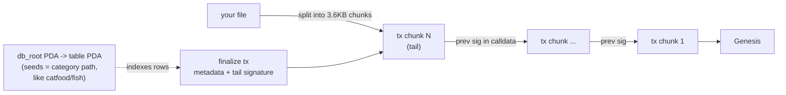
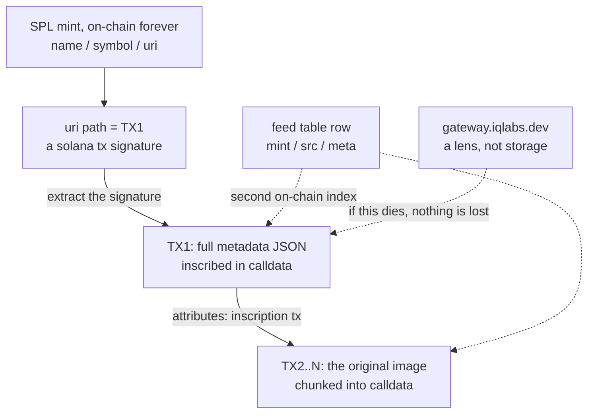

# Why IQ inscriptions matter

The future our 6000x cheaper inscriptions open up.

Different from data that lives on somebody's server. Different from tiny 4KB inscriptions. Our coins are different, and this page explains exactly why, at the protocol level.

## What can you do with code-in

Inscribe the Bible. Write a contract. Upload the Epstein files. Upload an alien.

Onto the blockchain. The place with no delete button.

Then turn it into a coin, with its image living on Solana, where nothing dies.

## Chapter 1: the protocol

IQ is a protocol that writes data into transactions themselves, forming a linked list, or anchoring them to PDAs and mappings, so that large data can live entirely inside Solana transactions.

Data is split into 3.6KB chunks and written straight into transaction calldata. Not account storage, the transactions themselves. Each chunk transaction points at the previous one, and the final write records the tail signature, so a reader walks the chain backwards until Genesis and reassembles the file. For big files a session PDA batches the chunks instead.

On top of that sits a database layer: PDA seeds work like a hash table path, the way you would file churu under catfood/fish. db_root and table PDAs derived from seeds organize rows logically, which is what lets apps like an on-chain 4chan, chat, or a github hand their data to the blockchain.



Reading is the reverse walk: follow the pointer, fetch the transactions, reassemble. There is no original on any server. The chain is the original.

Simple diagram above; for the deep dive see the whitepapers in this post: https://x.com/IQLabsOfficial/status/2014131287871627554

## Chapter 2: how a coin gets attached

This is where we split from every pump.fun coin.

Every SPL token stores exactly three things on-chain: name, symbol, uri. A normal coin puts an IPFS link in the uri. We put a Solana transaction signature in the uri path.

```
uri = https://gateway.iqlabs.dev/token-meta/<TX1>
                                            ^^^^^
                                  this IS a solana tx signature
```

That transaction holds the coin's entire metadata JSON, inscribed. And that JSON points at the inscription transaction of the original image itself.

mint -> metadata tx -> original tx. What looks like a link is really a chain of Solana tx ids.



## Chapter 3: what if we all disappear

"What if that gateway domain dies?"

It does not matter. The domain is a lens, not storage.

The uri string is baked into the mint forever. Pull the 88-character signature out of it, call getTransaction once, and the metadata comes back. Once more for the source signature inside it, and the original image reassembles chunk by chunk. Anyone with an RPC can do this, at any time.

No central servers. No AWS. The coin and its original live on the same chain, together. This is code-in.

## See it yourself

Do not take our word for it. Follow the pointer chain on any explorer:

1. The mint, on-chain: `E4cm5MW4GhChR36T6EWhwDVnQqDTqAqCwRYQ4GZ2hbzZ`
   Its Metaplex metadata `uri` field reads:
   `https://gateway.iqlabs.dev/token-meta/3Kaf1kg5B8EV5hhxsMQJc7CqWBEMoHix8DPwMJS5GjduJFxgCc5MKXAbN8YZe12z97EgVPVYw7SBRu97fWFCTSWt`
   That path is not a file on a server. It is a transaction signature.

2. The metadata transaction, on-chain:
   `3Kaf1kg5B8EV5hhxsMQJc7CqWBEMoHix8DPwMJS5GjduJFxgCc5MKXAbN8YZe12z97EgVPVYw7SBRu97fWFCTSWt`
   Its instruction data holds the full metadata JSON as inscribed bytes.

3. The original image transaction, on-chain:
   `5Si8irr4pKdEPoNDfMshB13G3jZyXpTuKKizHVbvwJqbcCjvyAKAAP8Uhrc5KCUaLvvw5CQupyjPZVuKQ4kav4Eu`
   and its chunk transactions carry the raw image bytes in calldata.

Screenshot to attach: open the metadata or a chunk transaction on Solana Explorer or Solscan, expand the instruction, and capture the raw instruction data / hex bytes panel. That panel of bytes sitting inside a normal Solana transaction is the whole point: the coin's data is right there in the transaction, not behind a link.

## What we are building on this

With this technology we are building an on-chain 4chan, NFT rails, everything turned into an asset and discussed in a decentralized place, plus an AI skill and reputation network.

Come in and code-in with us.

- Contract: https://github.com/IQCoreTeam/IQLabsContract
- SDK: https://github.com/IQCoreTeam/iqlabs-solana-sdk
