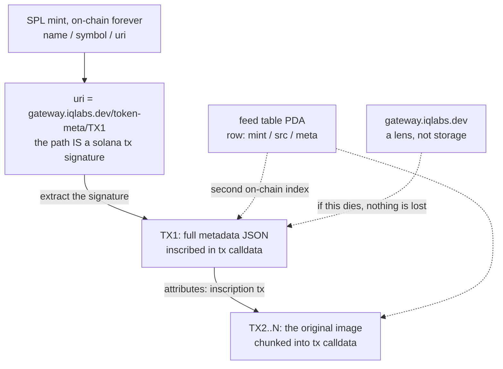

# Why IQ inscriptions are not like pump.fun coins

Check where your coin's image actually lives. For 99% of tokens the answer is an IPFS pin or somebody's server. When the pin drops, the image breaks. When the server dies, the coin is just a name.

Coins launched from the IQ board are different: the image, the metadata, and the mint all live on Solana itself. This page explains why that is technically true, not marketing.

## What you can inscribe

Inscribe the Bible. Write a contract. Upload the Epstein files. Upload an alien.

Onto the blockchain. The place with no delete button.

Then turn it into a coin whose image can never die.

## Chapter 1: what an IQ inscription is

Data is split into 3.6KB chunks and written directly into Solana transaction calldata. Not into account storage, into the transactions themselves. A transaction can never be edited or deleted, so the bytes are final the moment they land.

PDAs act as the address book: on-chain mappings that record which transactions make up one file (session and table PDAs derived from seeds, linked to the chunk transactions).

Reading is the reverse walk: follow the PDA mapping, fetch the transactions, reassemble the chunks. There is no original sitting on a server. The chain is the original.

## Chapter 2: how a coin gets attached

Every SPL token stores exactly three things on-chain: name, symbol, and a uri string (up to 200 bytes). Normal coins put an IPFS link in the uri.

We put something else in the path: a Solana transaction signature.

```
uri = https://gateway.iqlabs.dev/token-meta/<TX1>
                                            ^^^^^
                              this path segment IS a solana tx signature
```

TX1 is a code-in inscription that contains the coin's entire Metaplex metadata JSON. And that JSON points at TX2..N, the inscription of the original image (or text) itself, chunked into calldata.

So the full chain of custody is:

mint (on-chain) -> uri string (on-chain) -> TX1 metadata JSON (on-chain calldata) -> TX2..N original bytes (on-chain calldata)

Every hop is Solana native. What looks like a link is really a transaction id wearing a URL as a coat.



## Chapter 3: why it survives us

"What if that gateway domain dies?"

It does not matter. The domain is a lens, not storage.

The uri string is baked into the mint forever. Pull the 88-character signature out of it, call getTransaction once, and the metadata JSON comes back. Call it again for the source signature inside, and the original image reassembles chunk by chunk. Anyone with an RPC endpoint can do this, at any time, with no permission from us.

There is also a second, independent on-chain index: the board's feed table stores a registry row per launched coin with the mint, the source inscription tx, and the metadata inscription tx. Even a wiped uri could not orphan the data.

No central server. No IPFS pin. No AWS. The coin and its original live on the same chain, and they die together or not at all. Recovery needs exactly one thing: a Solana RPC.

The reference reader is open source: `@iqlabs-official/solana-sdk` (readCodeIn and friends). But nothing about the format needs our SDK. The bytes are right there in the transactions.
