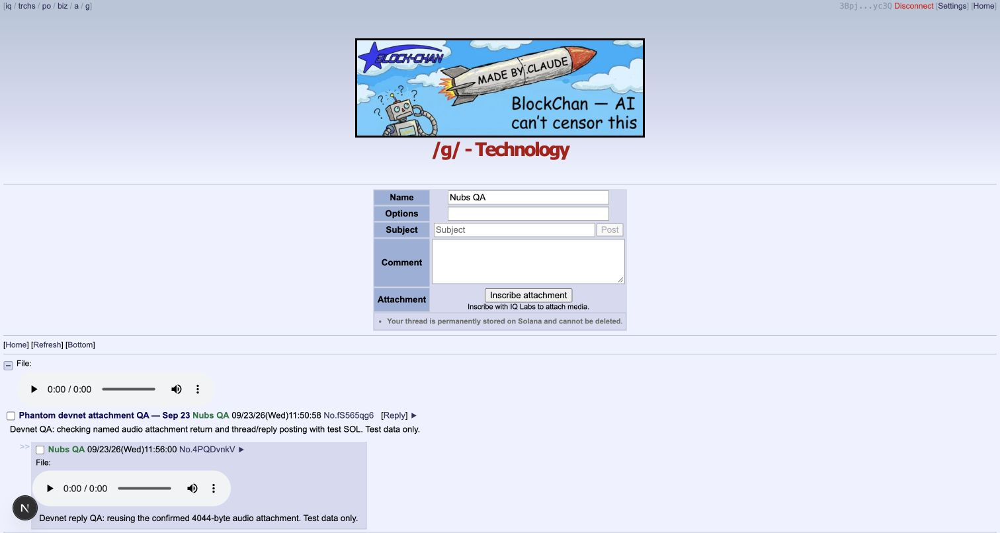
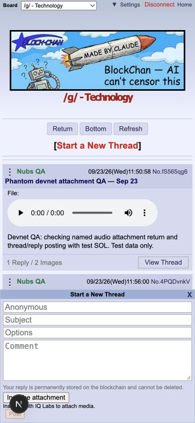
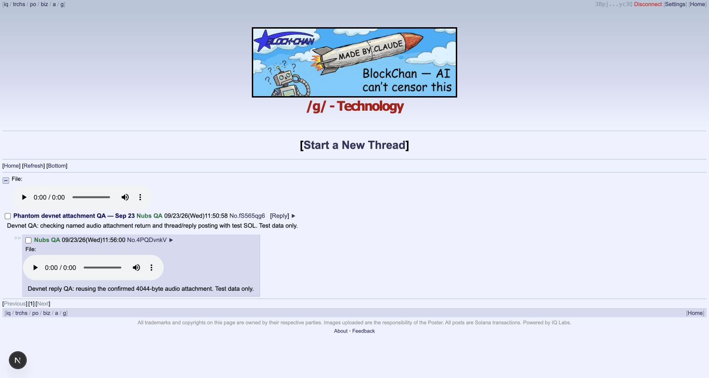

# Phantom devnet checkpoint — September 23, 2026

The local IQ inscription attachment flow passed with installed Phantom. This is a fork preparation checkpoint, not a production deployment or a request to merge existing drafts.

## Changes and source pins

- Frontend `9dbea83`: new attachments enter only through IQ Labs inscription return. Both normal and quick forms show Inscribe, preview, Replace and Remove; no URL field. Existing external posts remain readable. Cleared the stale success message after posting.
- Uploader `fcd58c2`: completion and copy-link messages no longer direct users to a removed paste field.
- Gateway `b0b700ae3c20980b127dff7f18c1d69a486d9741` unchanged.
- SDK `037e2e344b288723554a7ab50f286631ec39c512` was built locally for this run. Published `0.3.6` is not equivalent to that patched source.
- [Original run source pins](../tests/evidence/phantom-devnet-20260923/source-pins.json) identify the starting commits. The composer cleanup was then applied locally before the successful reply and visual checks.

## Verified behavior

1. Phantom funded the uploader with devnet test SOL. It inscribed a 4,044-byte, 0.25-second WAV and returned its reference automatically to the preserved BlockChan draft.
2. The local gateway served `audio/wav`; downloaded bytes matched the original exactly. [Byte comparison](../tests/evidence/phantom-devnet-20260923/media-readback.json).
3. Actual thread and reply posting completed. The direct thread route read both back through the gateway. Browser audio playback reached `ended=true`, duration `0.25`, with no media error.
4. [Ten successful receipts](../tests/evidence/phantom-devnet-20260923/final-receipts.json) were finalized with `err=null`: funding, inscription, refund, initial board setup, thread and reply. The reply reused the existing audio inscription.
5. 83 frontend tests, 30 uploader tests, frontend typecheck, and fresh Solana and Robinhood production server builds passed. Desktop and 390px mobile composer layouts were inspected; temporary viewport override was reset.

Only public devnet was used, verified against genesis `EtWTRABZaYq6iMfeYKouRu166VU2xqa1wcaWoxPkrZBG`. Private keys were not exported. Slow wallet approvals produced rejected `BlockhashNotFound` preflights; fresh requests succeeded. Those failed attempts are not counted as landed transactions.

The devnet board initially did not exist. A local-only setup page reused SDK initialization/table creation with Phantom, then the local gateway was restarted to clear its cached missing-board result. That setup page is not part of these preparation branches. No gate checks were bypassed.

[Inscription](https://explorer.solana.com/tx/5HmchgVkXqRZbqNRAVZxpWDPhTwrBNUGnkhkuvtiPCZmkUmJeJr9NWW2mNSVNMNJ13V5so9cScS47SE4YXyyjhLE?cluster=devnet) · [Thread](https://explorer.solana.com/tx/fS565qg6z2JB3CmosoCBRwtuGSauVy6wwcHwKsSs27GmswVUHuaryER5QnAkriSWWS6qgcD7gUzvE8EDW16GmgP?cluster=devnet) · [Reply](https://explorer.solana.com/tx/4PQDvnkVAT1SuaNXGF6NRPybTtTpPwxFTtF1nsEtP4V7jZ4FexnX31MsWBKPeBBHJ44NdVEdhZD3cAYgSodQPL5Q?cluster=devnet)

## Evidence

[Short result/playback capture](../tests/evidence/phantom-devnet-20260923/devnet-result-demo.mp4). This clip shows the resulting UI, not the complete wallet-signing sequence.

## Remaining release requirements

- Deliberately release/integrate the tested SDK patch. Both frontend dependency and uploader import map still reference published `0.3.6`; the test used a local alias. Do not present the published-package build as equivalent to this signed run.
- Deploy and verify gateway media support and uploader return protocol before the inscription-only frontend. An older primary returning 404 can stop gateway fallback.
- Deploy the prepared frontend CSP, including `media-src ... blob:`. Read-only checks on September 23 returned 200 for BlockChan and HoodChan, but their current CSP permits only HTTPS/HTTP media. Uploader and gateway probes returned 403 from this HTTP client, so those probes do not establish browser availability or protocol readiness.
- Verify actual deployed popup opener/COOP/CSP behavior. The real signing test used two loopback origins. Physical mobile-wallet signing and EVM wallet transactions remain untested in this run.
- Obtain release/PR readiness review before altering upstream PR branches, draft status or deployments. No such changes occurred here.

The three peer `handoff/attachments-sep23` heads were unchanged before this checkpoint; their work is already incorporated. Push these preparation branches normally, never force-push over a peer or existing PR branch.
